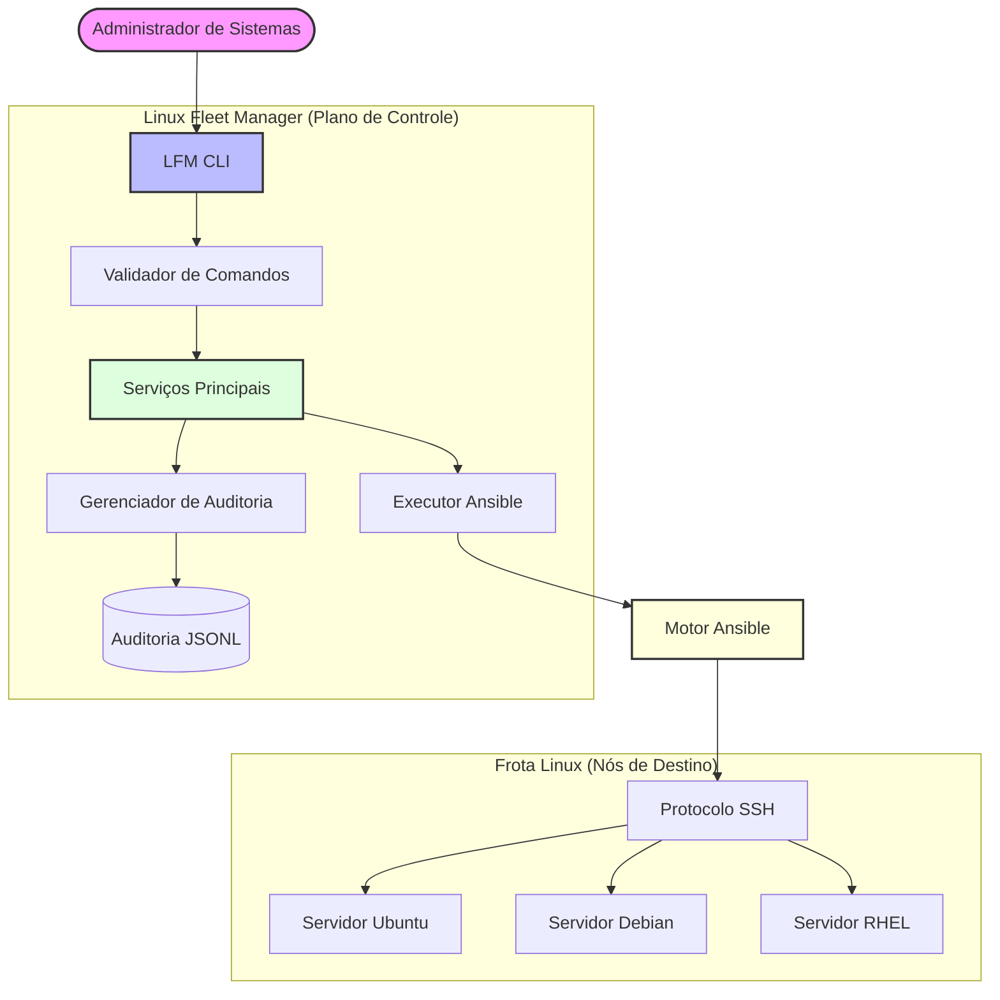

# 🐧 Linux Fleet Manager (LFM)

**Orquestração e gerenciamento de infraestrutura Linux baseada em Ansible.**

Linux Fleet Manager é uma ferramenta CLI projetada para administradores de sistemas e engenheiros DevOps que precisam de uma interface simplificada e auditável para gerenciar frotas de servidores Linux. Ao atuar como um wrapper inteligente sobre o Ansible, o LFM oferece um plano de controle unificado para monitoramento de saúde, gerenciamento de pacotes e execução remota, eliminando a necessidade de escrever playbooks YAML para tarefas rotineiras.

## 🚩 O Problema

Gerenciar múltiplos servidores Linux manualmente é inviável em escala:
- **Inconsistência**: Drift de configuração quando atualizações são aplicadas manualmente.
- **Ineficiência**: Executar verificações de saúde ou atualizações de pacotes em múltiplos nós consome tempo excessivo.
- **Falta de Visibilidade**: Ausência de registro centralizado de quem executou qual comando e qual foi o resultado.
- **Risco**: A execução manual de comandos destrutivos sem confirmação é uma ameaça constante.

## 💡 A Solução

O LFM implementa uma arquitetura de orquestração que abstrai a complexidade do Ansible, mantendo sua robustez e segurança.

**Fluxo de Execução:**
`LFM CLI` $\rightarrow$ `Core (Lógica e Validação)` $\rightarrow$ `Ansible Executor` $\rightarrow$ `Protocolo SSH` $\rightarrow$ `Frota Linux`

Essa arquitetura garante que toda ação seja validada, registrada em trilha de auditoria e executada de forma determinística.

## ✨ Funcionalidades

- **📦 Gerenciamento de Pacotes**: Instalação e remoção centralizada de pacotes (`lfm package install/remove`).
- **🚀 Atualização do Sistema**: Atualizações orquestradas de pacotes do sistema (`lfm update`).
- **🩺 Verificações de Saúde**: Validação automatizada de indicadores básicos (CPU, RAM, Disco, Serviços) via playbook especializado.
- **🖥️ Execução Remota**: Execução de shell controlada com confirmação obrigatória para mitigar erros humanos.
- **🛠️ Manutenção**: Ciclos de manutenção automatizados para limpeza de cache e arquivos temporários.
- **📋 Gerenciamento de Inventário**: Organização de hosts e grupos via arquivos INI.
- **⏱️ Monitoramento de Status**: Verificações rápidas de conectividade e latência via `ping`.
- **📜 Trilha de Auditoria**: Registro imutável de todas as operações em formato JSONL para conformidade.
- **📊 Relatórios de Frota**: Geração de relatórios consolidados do estado da frota em HTML, CSV ou JSON.
- **🪵 Logging Estruturado**: Logs JSON rotativos para observabilidade do sistema.

## 🏗️ Arquitetura



## 🛠️ Stack

- **Linguagem**: Python 3.12+
- **Orquestração**: Ansible
- **Transporte**: SSH (OpenSSH)
- **UI**: Typer & Rich (Saída de terminal profissional)
- **Validação**: Pydantic (Modelagem de dados)
- **Ambiente**: Otimizado para Linux & WSL2

## 💻 Exemplos de CLI

### Saúde da Infraestrutura
```bash
# Verificar conectividade de todos os hosts
lfm status check

# Executar diagnóstico de saúde na frota
lfm health run
```

### Gerenciamento Remoto
```bash
# Atualizar todas as estações de trabalho
lfm update --group workstations

# Instalar um pacote em um host específico
lfm package install nginx --host web-server-01

# Executar um comando remoto controlado
lfm exec run "df -h"
```

### Observabilidade & Auditoria
```bash
# Ver histórico de operações recentes
lfm history list

# Gerar um relatório consolidado da frota
lfm report generate --format html
```

## 📂 Estrutura do Projeto
```text
linux-fleet-manager/
├── ansible/            # Playbooks Ansible e lógica do executor
│   ├── runner.py       # Wrapper de subprocess para ansible-playbook
│   └── playbooks/      # Definição YAML das ações da frota
├── cli/                # Interface de comando baseada em Typer
│   ├── main.py         # Ponto de entrada da CLI
│   └── commands/       # Módulos de comandos individuais
├── core/                # Lógica de negócio e serviços do sistema
│   ├── audit.py         # Gerenciamento da trilha de auditoria
│   ├── config.py         # Configurações Pydantic
│   ├── inventory.py      # Resolução de hosts/grupos
│   ├── models.py         # Modelos de dados Pydantic
│   ├── reporting.py      # Motor de geração de relatórios
│   └── validation.py     # Segurança e detecção de segredos
├── logs/                # Logs estruturados rotativos e trilha de auditoria
├── reports/             # Relatórios de frota gerados (HTML/CSV/JSON)
└── tests/               # Suíte de testes unitários e de integração
```

## ⚙️ Instalação (WSL2)

1. **Dependências do Sistema**:
   ```bash
   sudo apt update && sudo apt install -y python3-pip ansible ssh
   ```

2. **Clonar e Configurar**:
   ```bash
   git clone https://github.com/your-username/linux-fleet-manager.git
   cd linux-fleet-manager
   python3 -m venv .venv
   source .venv/bin/activate
   pip install -r requirements.txt
   ```

3. **Configuração da Chave SSH**:
   Garanta que sua chave pública esteja distribuída para a frota de destino:
   ```bash
   ssh-copy-id user@remote-host
   ```

## 🔒 Configuração

### Inventário
Edite `ansible/inventory/hosts.ini` para definir sua frota:
```ini
[webservers]
web-01 ansible_host=192.168.1.10 ansible_user=admin
web-02 ansible_host=192.168.1.11 ansible_user=admin

[dbservers]
db-01 ansible_host=192.168.1.20 ansible_user=admin
```

### Configurações
A configuração pode ser gerenciada via `config.yaml` ou variáveis de ambiente (prefixadas com `LFM_`).

## 🛡️ Segurança

O LFM adota práticas de redução de risco para operações em larga escala:
- **Mascaramento de Segredos**: Comandos contendo padrões de senhas ou tokens são redigidos dos logs de auditoria para evitar vazamento de credenciais.
- **Confirmação Obrigatória**: Toda execução de comando arbitrário via `lfm exec` exige confirmação manual, prevenindo a execução acidental de comandos destrutivos.
- **Escalonamento de Privilégios**: O uso de `become` (sudo) é controlado via Ansible, garantindo que a elevação de privilégios seja explícita e registrada.
- **Isolamento de Execução**: A conectividade é delegada ao motor Ansible, aproveitando a segurança e estabilidade do protocolo SSH padrão da indústria.

## 🛠️ Desenvolvimento

### Executando os Testes
```bash
source .venv/bin/activate
pytest tests/
```

### Adicionando Novos Comandos
1. Crie um novo módulo em `cli/commands/`.
2. Implemente a lógica em `core/` caso envolva regras de negócio.
3. Registre o comando em `cli/main.py`.

## 🗺️ Roadmap

- **V1 (Atual)**: Orquestração de pacotes, execução remota, trilha de auditoria e relatórios consolidados.
- **V2**: Integração com inventários dinâmicos (AWS/NetBox) e suporte a execução assíncrona para frotas massivas.
- **V3**: Dashboard web para monitoramento em tempo real e agendamento de janelas de manutenção.
